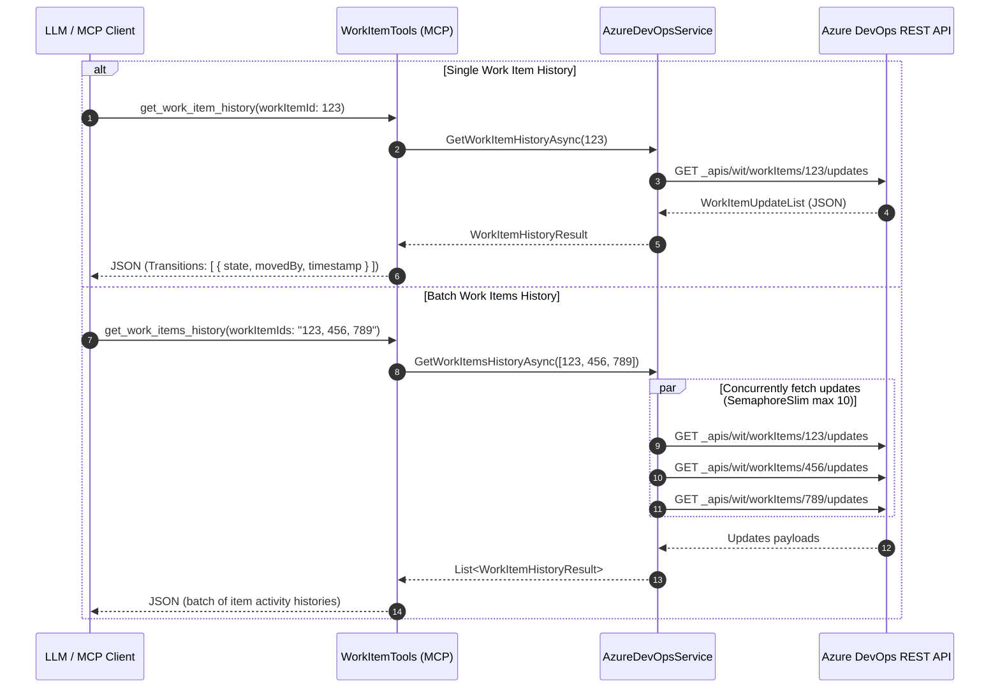

# Technical Analysis: Work Item Activity & State Transition History

**Feature Title:** Azure DevOps Work Item Activity & State Transition History  
**Document Status:** Complete — Pending Phase 2a Gate Sign-off (`discovery`)  
**Target Repository:** `SouzaEduardoAC/mcp-azure-devops`  

---

## 1. Context & Objectives

To support LLM board analysis (cycle time calculation, bottleneck detection, lead time auditing), `mcp-azure-devops` needs the capability to extract work item activity history—specifically state/column transitions, the timestamp of each move, and the identity of the user who moved the card.

---

## 2. Technical Investigation & Azure DevOps REST APIs

### 2.1 API Endpoint Selection
The Azure DevOps Work Item Query Language (WIQL) and standard Work Item GET endpoints return snapshot data (current field values). Historical transitions are available through the **Work Item Updates API**:

```http
GET https://dev.azure.com/{organization}/{project}/_apis/wit/workItems/{id}/updates?api-version=7.1
```

### 2.2 Response Payload Structure
An update payload contains an array of revision events (`value` array). Each element contains:
- `id` / `rev`: Revision number.
- `revisedBy`: Object with `displayName`, `uniqueName` (email), `descriptor`.
- `revisedDate`: UTC timestamp string.
- `fields`: Dictionary of modified fields in that revision.
  - `System.State`: `{ "oldValue": "New", "newValue": "Active" }`
  - `System.BoardColumn` or `WEF_*_Kanban.Column`: `{ "oldValue": "To Do", "newValue": "In Progress" }`

### 2.3 Field Extraction Logic
```csharp
if (fields.TryGetValue("System.State", out var stateChange))
{
    var oldState = stateChange.GetProperty("oldValue").GetString();
    var newState = stateChange.GetProperty("newValue").GetString();
    // Record state transition event
}
```

---

## 3. High-Level Architecture & Component Changes



### 3.1 Proposed Data Models (`Viamus.Azure.Devops.Mcp.Server/Models/`)
1. **`WorkItemStateTransition.cs`**:
   - `int Revision`
   - `string State`
   - `string? PreviousState`
   - `string? BoardColumn`
   - `string? PreviousBoardColumn`
   - `string MovedBy` (Display name / Email)
   - `DateTime Timestamp`
   - `double? DurationInHours` (Time spent in previous state)

2. **`WorkItemHistoryResult.cs`**:
   - `int WorkItemId`
   - `int TotalTransitions`
   - `List<WorkItemStateTransition> Transitions`

### 3.2 Key System Components
- **`IAzureDevOpsService.cs`**: Add `GetWorkItemHistoryAsync` and `GetWorkItemsHistoryAsync`.
- **`AzureDevOpsService.cs`**: Implement HTTP call to `_apis/wit/workItems/{id}/updates` with JSON parsing and `SemaphoreSlim(10)` batch throttling.
- **`WorkItemTools.cs`**: Expose `get_work_item_history` and `get_work_items_history` MCP server tools.

---

## 4. Performance & Rate Limiting Strategy

1. **Throttling Parallel Calls:** Batch retrieval uses `SemaphoreSlim(10)` to cap parallel HTTP requests to Azure DevOps to 10 concurrent calls.
2. **Opt-in Design:** Kept query tools (`query_work_items`) lightweight while enabling LLM agents to fetch histories selectively via the dedicated batch endpoint `get_work_items_history`.

---

## 5. Next Steps (Phase 2 Exit Criteria)

- Request approval for gate `discovery` on `docs/workitem-history-analysis.md`.
- Proceed to Sub-phase 2b (ADR Architecture Document).
